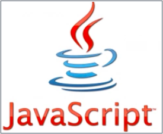
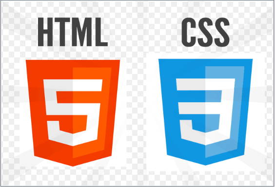
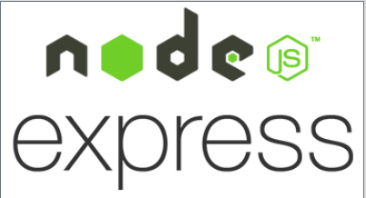
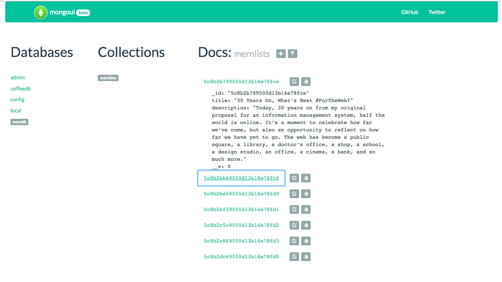
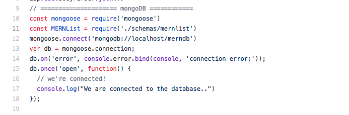
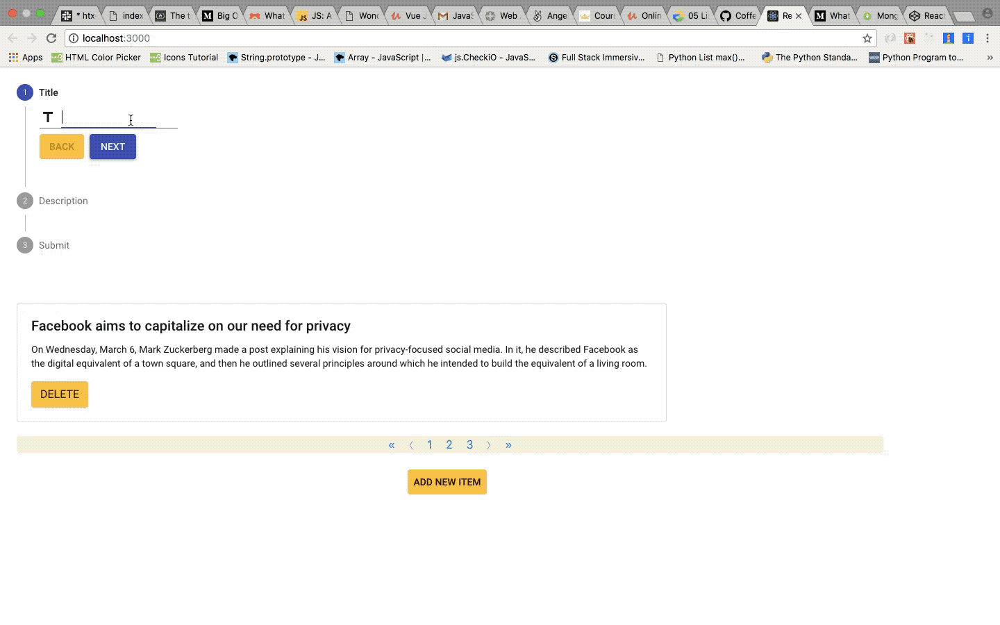
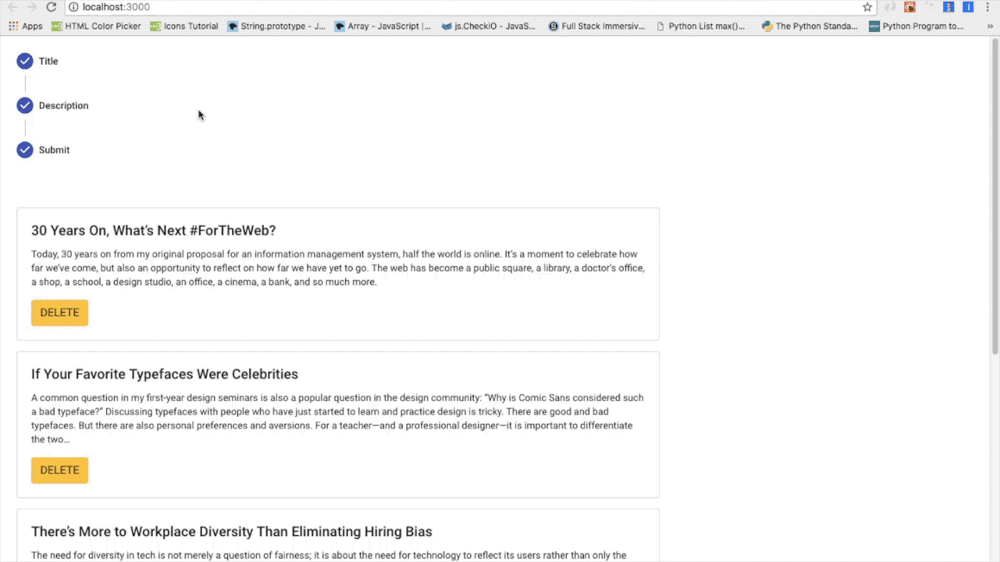

# MERN-Project-With-Form
* **Front End on the app:**

 

* **Back End on the app:**

 

* **Database on the app:**

* **Purpose of the app:** 
 Utilized various client-side, server-side frameworks and MongoDB by emphasizing database optimization including React, Node,  Express, MongoDB, CSS, HTML, and JavaScript.
 Developed a single page app where user can enter two inputs, title and description of a product or item, then click on 'submit' button to show it on the page. All the inputs entered by user is store in our mongoDB database. The list of user is paginated and each list includes no more than 5 items. User is allowed to delete an item from the list and enter a new item. 

* **Local Use of MongoDB:** 
- Run $mongod in the terminal to run mongoDB. It should keep running.
- Type 'mongo' in different window of terminal to open database.
- Run $npm i -g mongoui, then run $mongoui to see database structure online for your local mongodb.

* **Use of MongoDB on ServerSide:** 
- Run $npm install mongoose
- Mongoose configuration is made in app.js file in the serverSide folder.

- Created schemas folder, then form model structure including data types of item named as "title" and "description".

